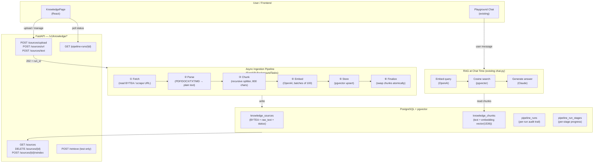
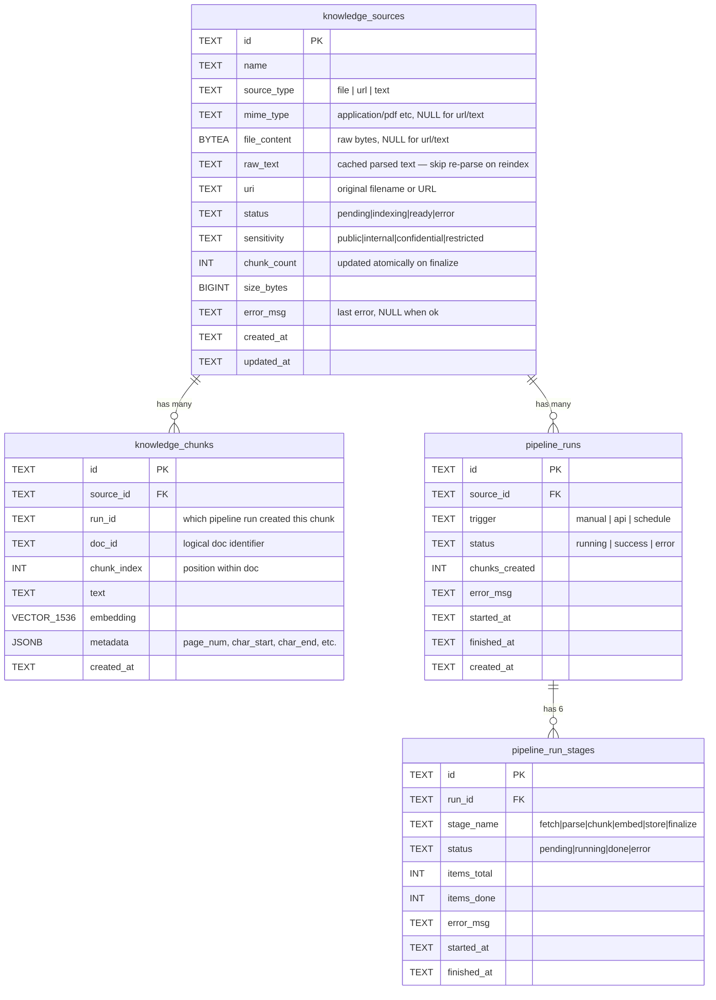
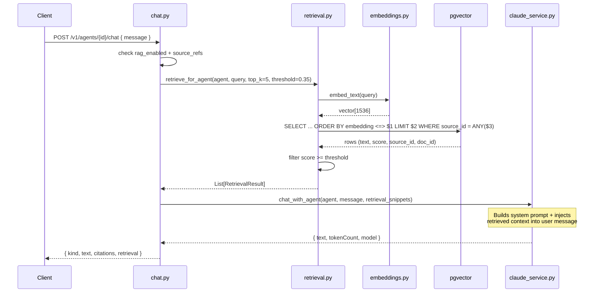

# Knowledge & RAG System — Architect's Design

> Designed to fit cleanly into the existing FastAPI + asyncpg + pgvector stack  
> with zero new infrastructure dependencies.

---

## 1. The Big Picture



---

## 2. Database Schema (Single Source of Truth)



### Key index decisions
```sql
-- Vector similarity (cosine) — HNSW for sub-linear search
CREATE INDEX idx_kc_embedding ON knowledge_chunks
  USING hnsw (embedding vector_cosine_ops)
  WITH (m = 16, ef_construction = 64);

-- Source scoping — every query filters by source_id first
CREATE INDEX idx_kc_source ON knowledge_chunks(source_id);

-- Composite: scoped similarity search
CREATE INDEX idx_kc_source_run ON knowledge_chunks(source_id, run_id);

-- Polling
CREATE INDEX idx_pr_source ON pipeline_runs(source_id, created_at DESC);
```

---

## 3. Ingestion Pipeline — Deep Design

### 3.1 API Contract

```
POST /v1/knowledge/sources/upload      multipart/form-data
     file: <binary>
     name: "Brightspeed Policy v2"
     sensitivity: "internal"

Response 202:
{
  "source_id": "ks-abc123",
  "run_id": "pr-xyz789",
  "status": "pending"
}
```

The API **returns immediately** (202 Accepted).  
The pipeline runs in `BackgroundTasks` — no blocking.

---

### 3.2 Stage-by-Stage Mechanics

```
┌─────────────────────────────────────────────────────────────┐
│  ① FETCH                                                    │
│                                                             │
│  file   → read BYTEA from knowledge_sources.file_content    │
│  url    → httpx.get(url, timeout=30s) → bytes               │
│  text   → already in raw_text, skip to chunk                │
│                                                             │
│  Output: bytes + mime_type                                  │
└─────────────────────────────────────────────────────────────┘
              ↓
┌─────────────────────────────────────────────────────────────┐
│  ② PARSE                                                    │
│                                                             │
│  application/pdf  → PyMuPDF (fitz.open)                     │
│  application/vnd* → python-docx                             │
│  text/html        → BeautifulSoup → get_text()              │
│  text/*           → decode UTF-8 directly                   │
│                                                             │
│  Output: plain text string                                  │
│  Cache: write to knowledge_sources.raw_text (for reindex)   │
└─────────────────────────────────────────────────────────────┘
              ↓
┌─────────────────────────────────────────────────────────────┐
│  ③ CHUNK                                                    │
│                                                             │
│  Strategy: Recursive Character Splitter                     │
│  Separators: ["\n\n", "\n", ". ", " ", ""]                  │
│  chunk_size  = 800  chars  (~200 tokens)                    │
│  chunk_overlap = 100 chars (~25 tokens)                     │
│                                                             │
│  Each chunk carries metadata:                               │
│    { char_start, char_end, chunk_index, doc_id }            │
│                                                             │
│  Output: List[Chunk]                                        │
└─────────────────────────────────────────────────────────────┘
              ↓
┌─────────────────────────────────────────────────────────────┐
│  ④ EMBED                                                    │
│                                                             │
│  Model: text-embedding-3-small (1536 dims)                  │
│  Batch: 100 chunks per API call                             │
│  Retry: exponential backoff (1s, 2s, 4s) on rate limit      │
│                                                             │
│  Stage progress: items_done updated after each batch        │
│                                                             │
│  Output: List[vector(1536)]                                 │
└─────────────────────────────────────────────────────────────┘
              ↓
┌─────────────────────────────────────────────────────────────┐
│  ⑤ STORE (atomic swap)                                      │
│                                                             │
│  BEGIN TRANSACTION                                          │
│    DELETE old chunks WHERE source_id = ? AND run_id != new  │
│    INSERT new chunks (tagged with new run_id)               │
│    UPDATE knowledge_sources SET                             │
│      status='ready', chunk_count=N, updated_at=now          │
│  COMMIT                                                     │
│                                                             │
│  ← Old chunks are NEVER deleted until new ones exist.       │
│    A failed mid-run leaves old chunks intact.               │
└─────────────────────────────────────────────────────────────┘
              ↓
┌─────────────────────────────────────────────────────────────┐
│  ⑥ FINALIZE                                                 │
│                                                             │
│  Mark pipeline_run status = 'success'                       │
│  Mark all pipeline_run_stages as done                       │
│  Update knowledge_sources.chunk_count + updated_at          │
└─────────────────────────────────────────────────────────────┘
```

---

## 4. Retrieval Design (Query Time)



### Retrieval SQL (scoped cosine search)
```sql
SELECT
    doc_id,
    source_id,
    text,
    chunk_index,
    metadata,
    embedding <=> $1::vector AS distance
FROM knowledge_chunks
WHERE source_id = ANY($2::text[])
ORDER BY embedding <=> $1::vector
LIMIT $3
```
The `source_id = ANY(...)` clause uses the B-tree index first, **drastically reducing the vector scan space** to only the agent's own sources. This is the key performance guard.

---

## 5. File Structure After Implementation

```
backend/
└── app/
    ├── db/
    │   ├── migrate.py          ← ADD: knowledge_sources, pipeline_runs, pipeline_run_stages tables
    │   ├── connection.py       (unchanged)
    │   ├── seed.py             (unchanged)
    │   └── seed_embeddings.py  (unchanged)
    │
    ├── repositories/
    │   ├── agents_repo.py         (unchanged)
    │   ├── knowledge_chunks_repo.py  ← MODIFY: add run_id, delete_by_run
    │   ├── knowledge_sources_repo.py ← NEW
    │   └── pipeline_runs_repo.py     ← NEW
    │
    ├── services/
    │   ├── embeddings.py      (unchanged — already batches correctly)
    │   ├── retrieval.py       (unchanged — already correct)
    │   ├── claude_service.py  (unchanged)
    │   └── ingestion/         ← NEW directory
    │       ├── __init__.py
    │       ├── pipeline.py    ← orchestrator (BackgroundTasks entry point)
    │       ├── parsers.py     ← PDF / DOCX / HTML / TXT
    │       └── chunker.py     ← recursive character splitter
    │
    ├── routes/
    │   ├── agents.py          (unchanged)
    │   ├── chat.py            (unchanged)
    │   ├── bootstrap.py       ← MODIFY: include knowledge_sources in payload
    │   └── knowledge.py       ← NEW: all /v1/knowledge/* endpoints
    │
    ├── env.py                 (unchanged)
    └── main.py                ← MODIFY: register knowledge_router
```

**Total: 5 new files, 5 modified files. Zero new infrastructure.**

---

## 6. Fault Tolerance & Identified Failure Modes

| Failure Mode | Risk | Mitigation |
|---|---|---|
| Upload interrupted mid-stream | Source stuck in `pending` | `status='error'` set in exception handler; user can re-upload |
| OpenAI rate limit during embed | Pipeline fails at stage 4 | Exponential backoff (3 retries); partial progress checkpointed per batch |
| Concurrent re-index of same source | Duplicate chunks | `source_id` lock via `SELECT ... FOR UPDATE` on source row before starting |
| Corrupt PDF / unreadable DOCX | Parse crash | Stage catches exception → `status='error'` + `error_msg` surfaced in UI |
| pgvector HNSW out of memory | Query slowdown | index built with `m=16` (conservative); add `SET max_parallel_workers_per_gather=2` |
| Source deleted mid-ingestion | Orphaned chunks | Pipeline checks source exists at finalize; if deleted, rolls back chunks |
| Very large file (>50 MB BYTEA) | Memory spike | Parse streams page-by-page (PyMuPDF page iteration); chunker processes lazily |
| Stale `raw_text` after file update | Re-index uses old text | Re-index path sets `raw_text=NULL` before fetch stage, forcing re-parse |
| Frontend polling hammers API | Load on DB | Poll interval min 2s; `pipeline_run_stages` is a tiny table — single row fetch |
| OpenAI key missing | Ingestion silently fails | API returns 503 with clear message; source stays `pending` |

---

## 7. API Reference (Complete Contract)

```
# Sources
GET    /v1/knowledge/sources                    → List[Source]
POST   /v1/knowledge/sources/upload             → { source_id, run_id } 202
POST   /v1/knowledge/sources/url                → { source_id, run_id } 202
POST   /v1/knowledge/sources/text               → { source_id, run_id } 202
GET    /v1/knowledge/sources/{id}               → Source (with chunk_count, status)
DELETE /v1/knowledge/sources/{id}               → 204 (deletes chunks too)
POST   /v1/knowledge/sources/{id}/reindex       → { run_id } 202

# Chunks (for preview)
GET    /v1/knowledge/sources/{id}/chunks        → List[Chunk] (first 20)

# Pipeline runs
GET    /v1/knowledge/pipeline-runs              → List[PipelineRun]
GET    /v1/knowledge/pipeline-runs/{id}         → PipelineRun + stages

# Retrieval testing (not used by chat — UI test only)
POST   /v1/knowledge/retrieve
       { query, source_ids, top_k, score_threshold } → List[RetrievalResult]
```

---

## 8. New Python Dependencies

Add to `backend/requirements.txt`:

```
pymupdf          # PDF parsing (fitz) — no native deps, pure Python wheels
python-docx      # DOCX parsing
beautifulsoup4   # HTML → text for URL sources
httpx            # async URL fetching
python-multipart # FastAPI multipart file upload support
```

---

## 9. Frontend Architecture

```
src/modules/knowledge/
├── KnowledgePage.tsx            ← MODIFY (new tabs, add source button)
└── components/
    ├── AddSourceModal.tsx        ← NEW (File/URL/Text tabs + drag-drop)
    ├── SourceCard.tsx            ← NEW (status badge, progress, actions)
    ├── PipelineRunDetail.tsx     ← NEW (stage-by-stage progress)
    ├── ChunkPreview.tsx          ← NEW (first N chunks from /chunks)
    └── RetrievalTestPanel.tsx    ← NEW (query → top-k results)
```

The frontend polls `GET /v1/knowledge/pipeline-runs/{id}` every **2 seconds** after triggering ingestion, updating the stage visualisation in real-time. Polling stops when `status` is `success` or `error`.

---

## 10. Implementation Order (Dependency-safe)

```
Step 1  migrate.py          — add 3 new tables (no deps)
Step 2  knowledge_sources_repo.py  — CRUD for new table
Step 3  pipeline_runs_repo.py      — CRUD for runs + stages
Step 4  knowledge_chunks_repo.py   — add run_id column support
Step 5  ingestion/chunker.py       — pure Python, no deps
Step 6  ingestion/parsers.py       — uses pymupdf, python-docx, bs4
Step 7  ingestion/pipeline.py      — orchestrator (uses steps 2-6)
Step 8  routes/knowledge.py        — FastAPI routes (uses step 7)
Step 9  main.py                    — register router
Step 10 bootstrap.py               — include sources in payload
Step 11 Frontend types + api.ts    — new types + API methods
Step 12 KnowledgePage + components — UI
```

Each step is independently testable. No circular dependencies.
